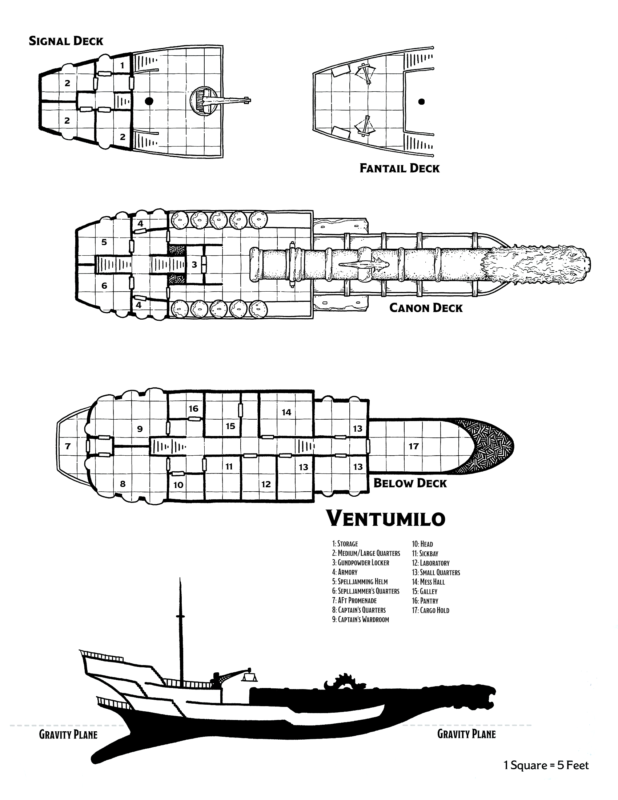

Die Ventumilo ist eine umgebaute Spelljammer der Bombarden-Klasse. Ursprünglich vom Volk der Giff entwickelt, ist sie quasi eine fliegende Kanone. Die Rumpfform der Ventumilo ähnelt der einer Schebecke, sie hat allerdings nur einen einzigen Mast an der Stelle, an der man bei einem Segelschiff den Besanmast erwarten würde. Dieser Mast ist eine gnomische Konstruktion, die mit nur einem Bedienhebel einen speziellen Fächer als Segel aufspannen kann. Die namengebende Funktion der Spelljammer.

Die Ventumilo kann schweben und auf einer Wasseroberfläche segeln aber nicht sicher auf festem Boden landen.

Die Öffnung der zentralen Kanone ist bei Schiffen der Bombarden-Klasse künstlerisch gestaltet. Wie die Abwandlung einer Galeonsfigur. Im Gegensatz zu den häufigen Monstermäulern ist die Öffnung der Ventumilo eine künstlerische Abbildung eines schreienden Kopfes eines Humanoiden ohne Geschlechtsbezug (_für die Vorstellung: der Kopf sieht aus wie der des "Sarkophag" des [Fünften Elements](https://www.imdb.com/title/tt0119116)_).

Diese Abbildung ist ein Symbolbild und Darstellung einer klassischen Giff-Bombarden-Spelljammer:

## Statistik

|||
| ----------------------------- | ----------------------------- |
| **Rüstungsklasse:** 15 (Holz)    | **Tonnage:** 150 Tonnen         |
| **Trefferpunkte:** 300           | **Crew:** 12                  |
| **Schadensschwellenwert:** 20      | **Länge/Breite:** 140 ft./30 ft. |
| **Bewegungsrate:** fliegen 35 ft. (4 mph) | **Kosten:** ?                   |

## Deckplan

---

### 2 Ballisten (Crew: je 3)

- **Rüstungsklasse:** 15
- **Trefferpunkte:** 50
- **Kosten:** 50 GP (Balliste), 5 GP (Geschoss)

Es benötigt 1 Aktion, um die Balliste zu laden, 1 Aktion um zu zielen und 1 Aktion um abzufeuern.

**Geschoss.** _Fernkampfwaffenangriff:_ +6 auf Treffer, Reichweite 120/480 ft., ein Ziel. Treffer: 16 (3d10) Stichschaden.

### Riesenkanone (Crew: 4)

- **Rüstungsklasse:** 19
- **Trefferpunkte:** 250
- **Kosten:** — (Kanone), 1,000 GP (Kanonenkugel)

Es benötigt 3 Aktionen, um die Riesenkanone zu laden und 1 Aktion, um abzufeuern.

**Kannonenkugel.** _Fernkampfwaffenangriff:_ +6 auf Treffer, Reichweite 600/2,400 ft., ein Ziel. Treffer: 88 (16d10) Wuchtschaden.

---

### (1) Lager

Ein gewöhnlicher, staubiger Lagerraum mit hohen Decken.

### (2) Kabine für Große

Das könnten Passagierkajüten sein, in jedem Fall sehr hohe Decken und stabil aussehende und recht große Betten.

### (3) Schießpulverschrank

Hier ist Schießpulver in einem verstärkten, tresoarartigen Einbauschrank gelagert.

### (4) Waffenkammer

Geschosse für die Ballisten, Speere, Armbrüsten und solche Sachen kann man hier finden. Ab hier mit niedriger Deckenhöhe.

### (5) Spelljamming Helm

Die Steuerszentrale der Ventumilo. Mit versenkbarem [Spelljamming Helm](https://www.dndbeyond.com/sources/sais/aag/astral-adventuring#SpelljammingHelm) und einem [Wildspace Orrery](https://www.dndbeyond.com/sources/sais/aag/astral-adventuring#WildspaceOrrery).

### (6) Kabine des Spelljammers

Fest eingebaute Möbel für jemanden mit kleiner Größe. In der Nähe des Spelljammer Helms, von daher vermutlich als Quartier für den Spelljammer gedacht.

### (7) Heckpromenade

Der Ort an dem Bug Mecktrowny von einer Offizierin des Xaryxischen Imperiums getötet worden war.

### (8) Kapitänskabine

Opulent, großzügig und sehr bequem eingerichtete Kabine. Vermutlich gedacht für eine Person, die hier das Sagen hat.

### (9) Offiziersmesse

Leer geräumter Raum mit leeren Schränken an den Wänden. In der Mitte ein seltsames Aquarium mit fliegenden Fischen.

### (10) Toilette

Luxuriöses Porzellan.

### (11) Krankenstation

Eine vollständige ausgrüstete Krankenstation.

### (12) Labor / Werkstatt

Ein Alchemielabor mit einer magischen Werkbank aus grünem Glas.

### (13) Kabine für Kleine

Das könnten Passagier- oder Besatzungskabinen sein. Für Personen mit kleiner Größe gedacht.

### (14) Kantine

Gemütliches Beisammensein an einem großen Tisch mit runder Bank drumherum.

Zugang zum Zwischendeck und den Schmugglerverstecken.

### (15) Kombüse

Hier arbeitet der Smutje. Niemals den Koch unterschätzen.

### (16) Vorratskammer

Lagerraum für Lebensmittel mit Durchreiche in die Kombüse.

### (17) Frachtraum

Lagerraum für Fracht mit hohen Decken.